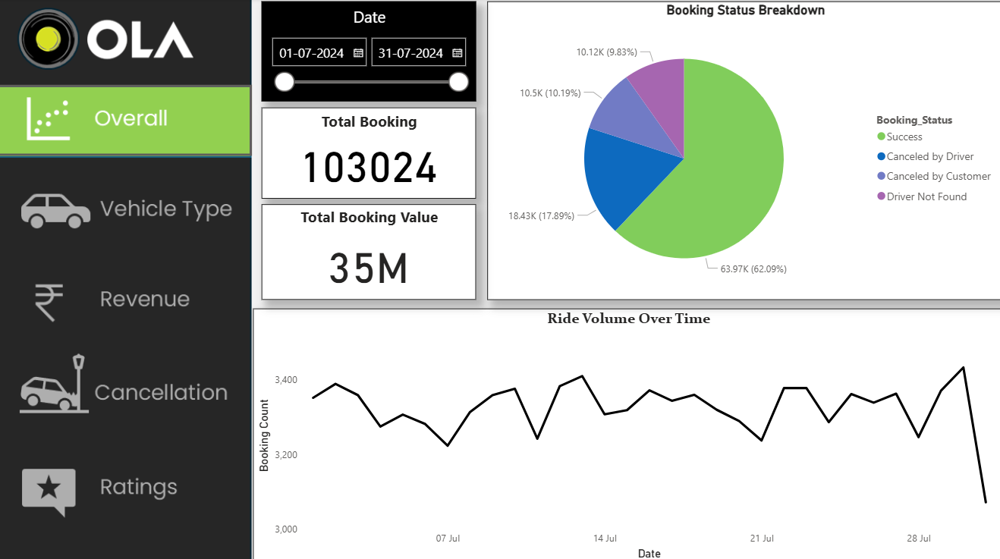
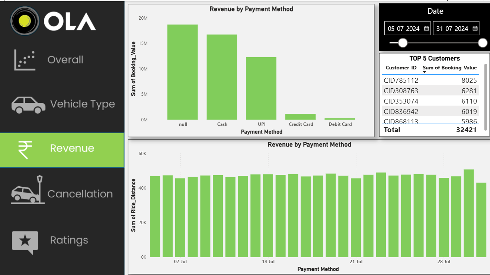
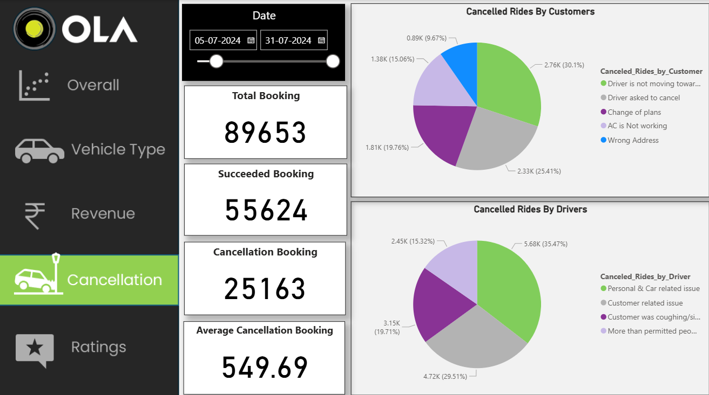
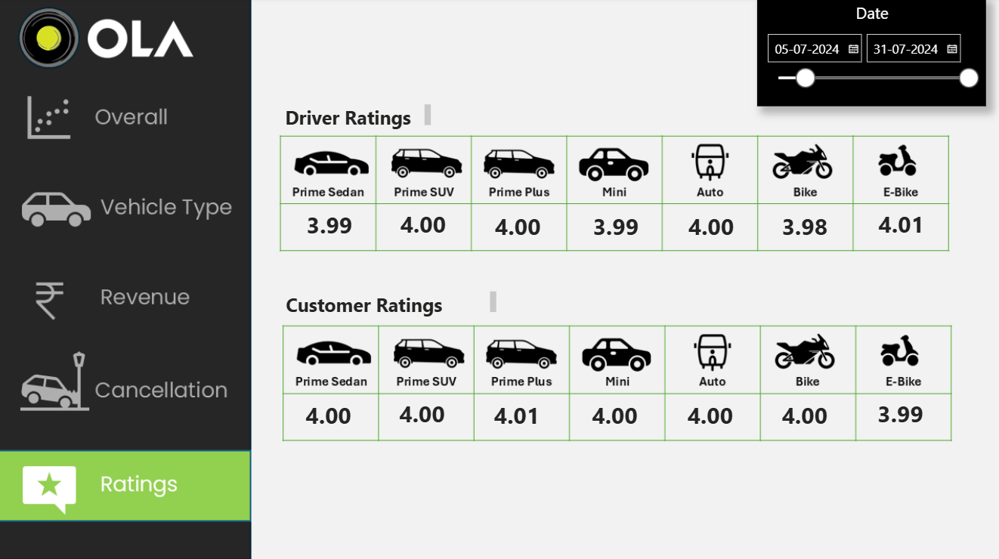

# 🚖📊 OLA Data Analytics: Case Study, Model Training & Power BI Dashboard 🤖✨

## 📄 Overview

This project presents an end-to-end analytics solution for Ola, one of India’s largest ride-hailing companies.
It integrates Python-based Machine Learning models with a Power BI Business Intelligence dashboard to transform raw operational data into actionable insights.

The solution helps Ola’s business & operations teams to:

📈 Understand booking trends over time

💰 Track revenue performance across cities & vehicle types

❌ Monitor ride cancellations and identify root causes

⭐ Analyze customer satisfaction & driver performance

🌍 Pinpoint top & low-performing cities, drivers, and vehicle categories

---

## 🔑 Major Components Covered

- 🧹 **Missing value handling** (median/mode imputation)  
- 📏 **Outlier treatment** with IQR & winsorization  
- 🏗️ **Feature engineering** (trip duration, fare/km, time features, etc.)  
- 📊 **EDA** (histograms, correlations, categorical insights)  
- 🤖 **Model training & evaluation**  
  - Linear Regression  
  - Decision Tree  
  - Random Forest  
  - XGBoost  
  - KNN  
  - Artificial Neural Network (MLP)   
- 📈 **Power BI Dashboard**: overall insights, vehicle type analysis, revenue, cancellations, ratings  

---
## 📂 Dataset Description  
The dataset (train.csv) contains detailed information about Ola ride transactions, capturing trip details, fare components, passenger information, and operational metrics. Each row represents a single ride record.

| Column Name         | Description                                                                 |
|---------------------|-----------------------------------------------------------------------------|
| ID                  | Unique identifier for each ride                                             |
| vendor_id           | ID of the vendor/company providing the ride service                         |
| pickup_loc          | Location ID where the passenger was picked up                               |
| drop_loc            | Location ID where the passenger was dropped off                             |
| driver_tip          | Tip amount given to the driver (₹)                                          |
| mta_tax             | Metropolitan tax applied to the trip                                        |
| distance            | Distance of the ride (in kilometers/miles depending on dataset)             |
| pickup_time         | Timestamp when the ride began                                               |
| drop_time           | Timestamp when the ride ended                                               |
| num_passengers      | Number of passengers for the trip                                           |
| toll_amount         | Toll charges incurred during the ride                                       |
| payment_method      | Mode of payment used (Cash, Card, Wallet, etc.)                             |
| rate_code           | Rate type code indicating type of trip (standard, premium, etc.)            |
| stored_flag         | Indicator if trip data was stored/flagged by the system                     |
| extra_charges       | Additional charges (e.g., surge, booking fee)                               |
| improvement_charge  | Fixed charge applied for system improvements/regulations                    |
| total_amount        | Final total fare amount paid by the customer (including all charges)        |

---

## 🧠 Model Implementation & Performance

| Model                | Test R² (↑) | Test MSE (↓) |
|----------------------|------------:|-------------:|
| Linear Regression    | ~0.90       | ~5.63        |
| Decision Tree        | ~0.9951     | ~0.295       |
| Random Forest        | **~0.9975** | **~0.149**   |
| XGBoost              | ~0.9823     | ~1.073       |
| KNN Regressor        | ~0.9523     | ~2.893       |
| ANN (Neural Net)     | ~0.9941     | ~0.355       |

✅ **Random Forest** performed best (highest accuracy + lowest error).  
⚠️ Decision Tree risked overfitting, while XGBoost was strong but not better than RF without heavy tuning.  

---

## 📈 Key Features
🔹 Core KPIs at a Glance

📌 Number of Rides Completed

💰 Total Revenue Generated

🚖 Average Fare per Ride

📏 Average Ride Distance

❌ Ride Cancellation Percentage

⭐ Average Customer Rating

---
🔹 Deep-Dive Analysis Areas

- Revenue Monitoring – Compare earnings across months and cities to spot growth opportunities

- Cancellation Trends – Detect when and where cancellations peak, along with possible reasons

- Driver Insights – Rank drivers based on revenue, trip count, and service quality

- Customer Experience – Track how satisfaction varies across regions and time

- Vehicle Preferences – Understand demand patterns across different car types (Mini, Prime, Auto, etc.)

- Payment Behavior – Analyze the shift between cash and digital payment methods
  
---

## 📊 Power BI Dashboard 
The interactive dashboard provides business insights at a glance:

### 🔎 Overall  
Summary metrics: total rides, total revenue, average fare, ride duration trends  


### 🚘 Vehicle Type Analysis  
Revenue, demand, and ratings by vehicle category (Mini, Prime, Auto, etc.)  


### 💰 Revenue Insights  
Breakdown by hour, fare distribution, extra charges & tips contribution  


### ❌ Cancellations  
Cancellation rates, reasons, and trends across time/vehicle types  


### ⭐ Ratings  
Customer & driver ratings distribution + comparisons  


👉 Open `OLA_Dashboard.pbix` in **Power BI Desktop** for the full experience.  

---

## 🛠️ Tech Stack

- **Python 3** 🐍 (Pandas · NumPy · Scikit-learn · XGBoost · TensorFlow/Keras)  
- **Power BI Desktop** 📊 for interactive analytics  
- **Excel/CSV** 📑 for raw data  

---

## 📌 Insights & Recommendations

⏰ Peak Booking Hours
Rides peak during evening rush hours; introducing discounts or loyalty rewards in off-peak hours can balance demand.

❌ Cancellation Hotspots
Certain cities and time slots face higher cancellation rates, better driver allocation & incentives can reduce these losses.

🚖 Driver Retention
Rewarding top-performing drivers with bonuses or recognition can improve driver satisfaction & retention.

🚗 Vehicle Optimization
Higher demand for Sedans in longer-trip areas suggests optimizing fleet allocation to boost revenue.

⭐ Customer Satisfaction
Insights from rating data can be used to design driver training programs, improving service quality and long-term loyalty.

---

## 🚀 How to Run

1. Clone the repository:
   ```bash
   git clone https://github.com/Sakshi-Khandagale/OLA-Data-Analytics.git

